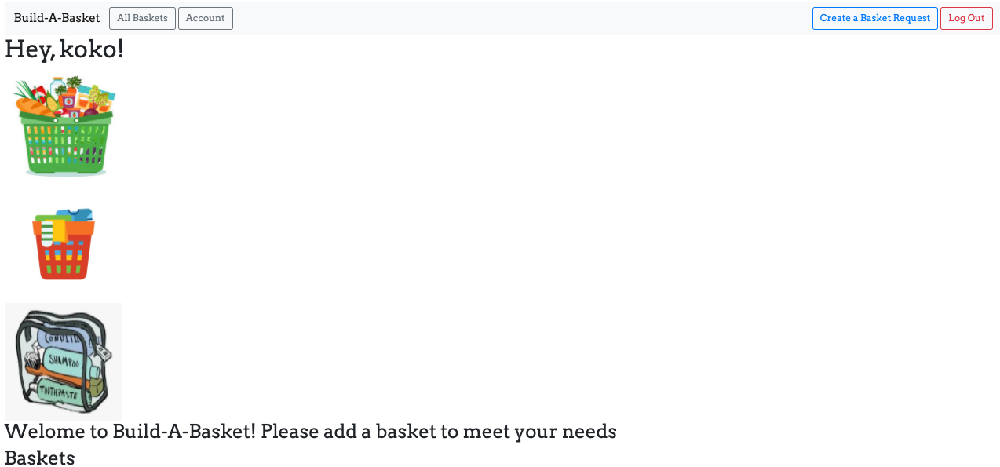
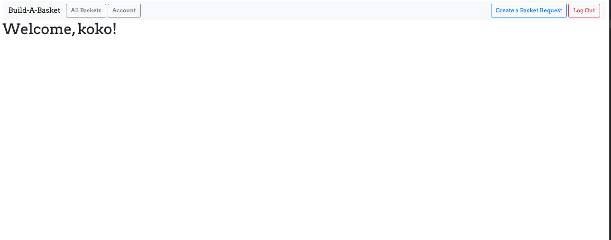
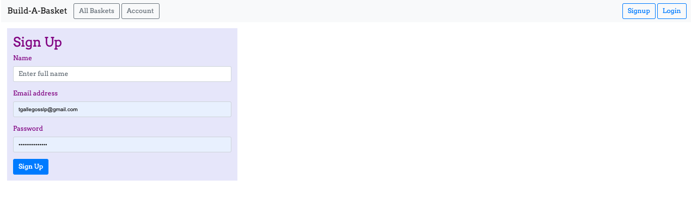

# Build-A-Basket
### Flask App 

#### About the App
This app was designed to address the sytemic issue of poverty and lack of resources.
It is meant to address the specific needs of families to make sure that more families
get the items they are in need of to improve their quality of life. 

## Technologies: 

```bask
Python, Flask, Jinja2, Bootstrap, Google Fonts, CSS
```

## Features: 

This app is allows a for full CRUD and also authorization. As a loggin in user,
you can create, update, view, and delete posts. As a user not logged in, you 
can view home page, about page, and all posts made by families in need.

## Images of working app
Landing Page:


Logged In User Account:


Sign up Form:


Log In Form


## Getting Started
Explore information and resources about the app on the landing page.
Login or sign up to explore the full features of the app
## Not deployed yet

## Trello board
https://trello.com/b/ZID4fJUx/build-a-basket#

## Stretch Goals/Future Goals:
* Add logged user, add ability to put a reqeust on hold(if in process of building basket for family in need, and add abliity to complete basket upon delivery*adding baskets completed to each family)
* Add date posted to data
* Add drop downs to form
* Add prices associated with drop down that produce a total so a person can get individual items from a basked and purchase them 
* Send message to family when items in their basket have been purchased by another user
* Allow user to upload profile pic/set default in User model
* Allow families to upload pics w/ items received
* Build out new model for Givers
* Allow users to send a thank you message to others who purchased items for them
